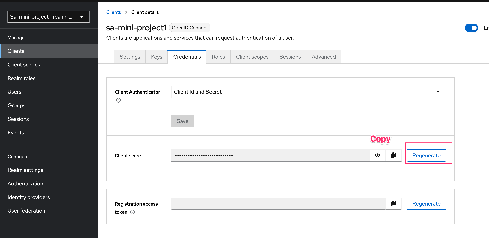
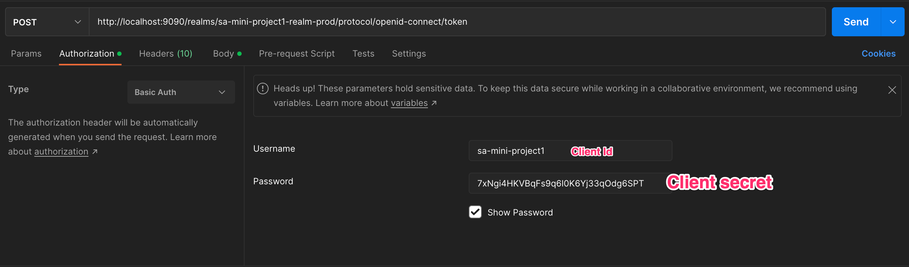
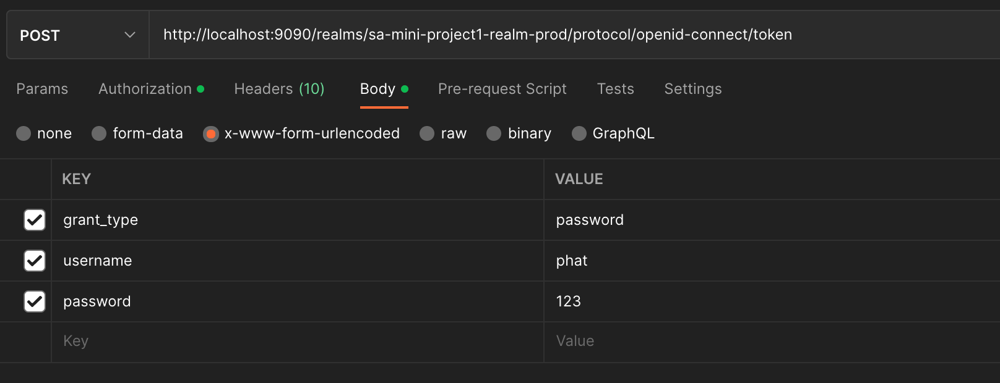
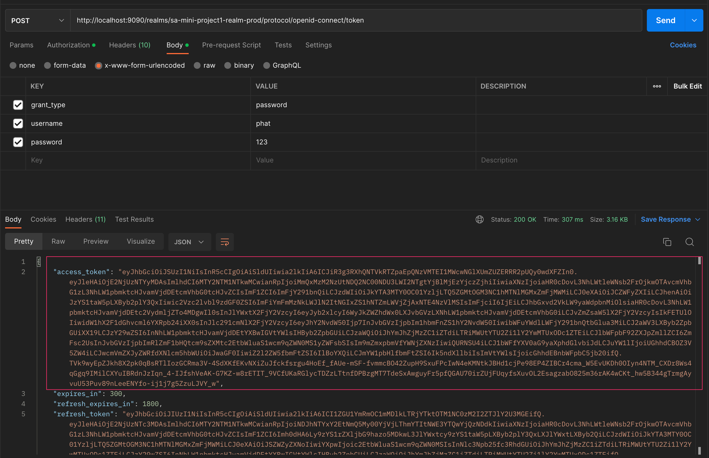
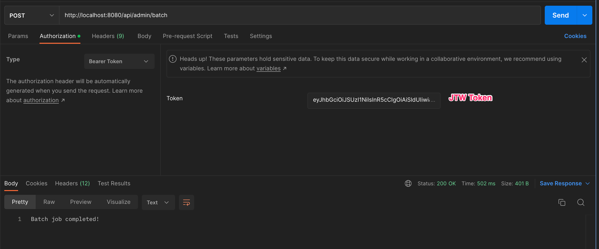

# SA Mini Project
## Members
1. Tuan Anh Nguyen
2. Tan Phat Nguyen

## Run project
1. Run docker compose to deploy the services
```
$ docker compose -f docker-compose.prod.yml up -d
```
2. Monitor logs
```
$ docker compose -f docker-compose.prod.yml logs -f
```
3. Import Realm into Keycloak
- Navigate to (http://localhost:9090/) to open Keycloak
- Select Create Realm -> Browser to file *realm-export.prod.json* to and click on Create
4. Create User
Create user and assign roles to ADMIN e.g username: phat, password: 123
6. Regenerate client secret
   
5. Get JWT token
```
Trigger POST request to http://localhost:9090/realms/sa-mini-project1-realm-prod/protocol/openid-connect/token
```




6. Trigger job with token

```
Trigger POST request to http://localhost:8080/api/admin/batch
```


7. Verify result in logs or postgres client
   
